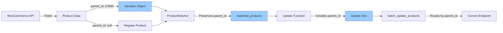

# Product Update Flow - Before vs After Fix

## BEFORE (v2.8 - BROKEN)

```mermaid
graph TD
    A[User Updates Product] --> B[Update Function]
    B --> C[Creates Update Dict]
    C --> D{Product Type?}
    D -->|Regular Product| E[/products/12345]
    D -->|Variation| F[/products/67890]
    F --> G[❌ WooCommerce Rejects]
    G --> H[Error: Use variations endpoint]
    E --> I[✅ Success]
    
    style G fill:#f99
    style H fill:#f99
    style F fill:#f99
```

**Problem**: All products sent to `/products/{id}` endpoint, but variations need `/products/{parent_id}/variations/{id}`

---

## AFTER (v2.9 - FIXED)

```mermaid
graph TD
    A[User Updates Product] --> B[Update Function]
    B --> C[Creates Update Dict with parent_id]
    C --> D[batch_update_products]
    D --> E{Has parent_id?}
    E -->|No - Regular| F[/products/12345]
    E -->|Yes - Variation| G[/products/67890/variations/12345]
    F --> H[✅ Success]
    G --> I[✅ Success]
    
    style H fill:#9f9
    style I fill:#9f9
    style C fill:#9cf
    style E fill:#fc9
```

**Solution**: Check parent_id and route to correct endpoint

---

## Data Flow with parent_id



---

## Key Changes in v2.9

### 1. ProductMatcher (Line 480)
```python
matched_product = {
    'sku': sku,
    'woo_id': woo_product['id'],
    'parent_id': woo_product.get('parent_id'),  # ← ADDED
    'woo_name': woo_product.get('name', ''),
    # ... rest of fields
}
```

### 2. Update Functions (8 locations)
```python
updates.append({
    "id": product['woo_id'],
    "parent_id": product.get('parent_id'),  # ← ADDED
    "regular_price": f"{price:.2f}"
})
```

### 3. batch_update_products (Already existed, now works)
```python
if parent_id:
    # Variation - use variations endpoint
    url = f"{store_url}/wp-json/wc/v3/products/{parent_id}/variations/{product_id}"
else:
    # Regular product
    url = f"{store_url}/wp-json/wc/v3/products/{product_id}"
```

---

## Testing Matrix

| Product Type | Has parent_id | Endpoint Used | Status |
|--------------|---------------|---------------|--------|
| Regular Product | No (None) | `/products/{id}` | ✅ Works |
| Product Variation | Yes (parent ID) | `/products/{parent_id}/variations/{id}` | ✅ Fixed in v2.9 |

---

## Example: GVS Brand Products

### HD9Y (Variation)
- **Product ID**: 12345
- **Parent ID**: 67890
- **Endpoint**: `/products/67890/variations/12345`
- **Status**: ✅ Now updates correctly

### Regular Product
- **Product ID**: 11111
- **Parent ID**: None
- **Endpoint**: `/products/11111`
- **Status**: ✅ Always worked

---

## Impact Summary

| Operation | Before v2.9 | After v2.9 |
|-----------|-------------|------------|
| Update regular product price | ✅ Works | ✅ Works |
| Update variation price | ❌ Reverts | ✅ Persists |
| Apply discount to variation | ❌ Reverts | ✅ Persists |
| Sync variation to Capital | ❌ Fails | ✅ Works |
| Batch update mixed types | ⚠️ Partial | ✅ All work |

